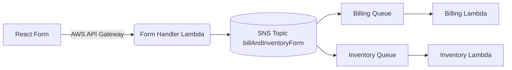

# React + AWS: Form Processing with SNS/SQS

## Architecture Diagram View

## Simple Workflow Explanation

1. **Form Submission**  
   - User submits data via React form
   - Form sends request to Form Handler Lambda

2. **Message Distribution**  
   - Lambda validates and publishes to SNS Topic
   - SNS duplicates message to both queues

3. **Parallel Processing**  
   - Billing Queue → Billing-Handler (Lambda)
   - Inventory Queue → Inventory-Handler (Lambda)

